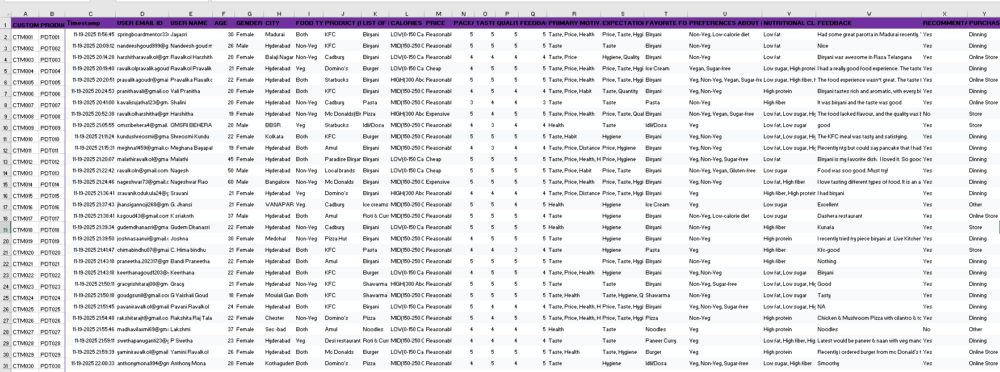
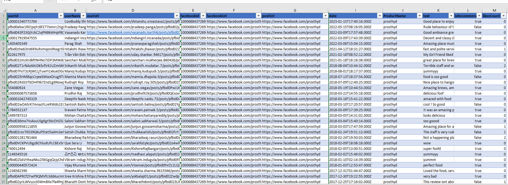
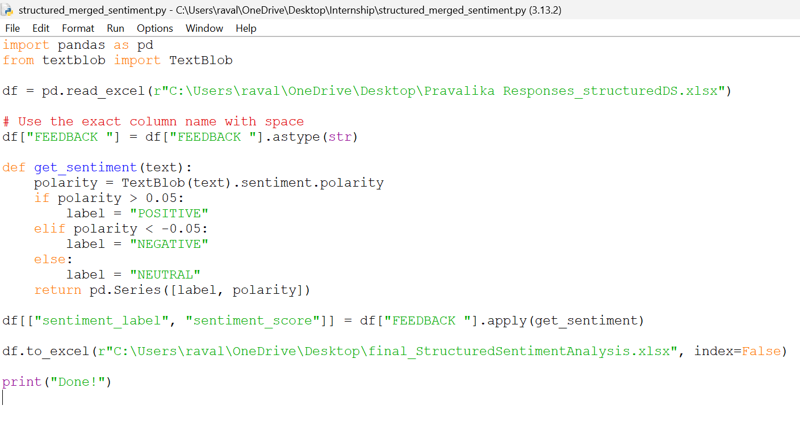
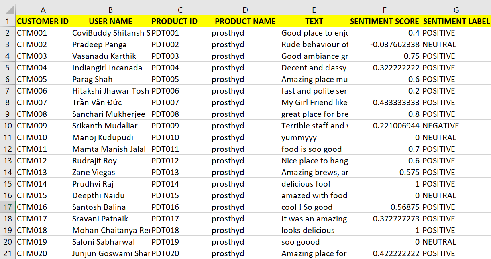
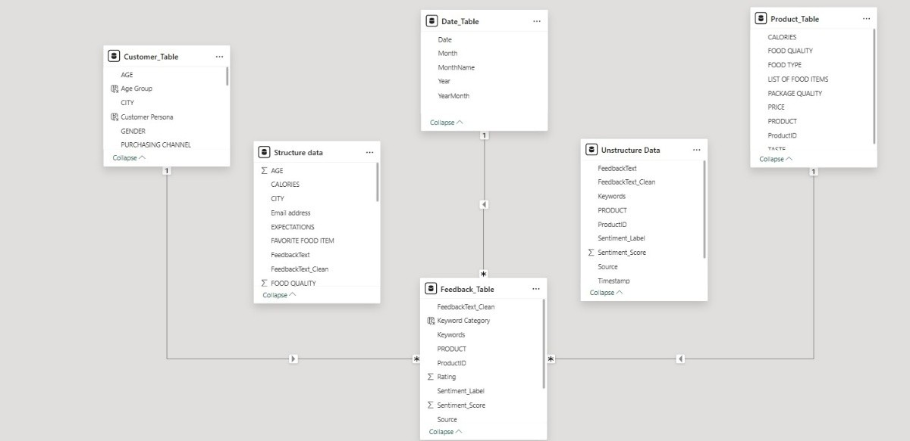
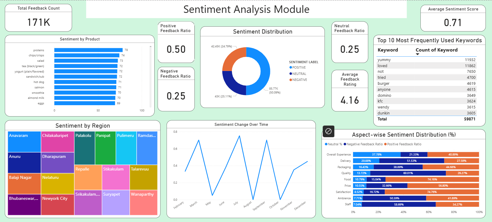
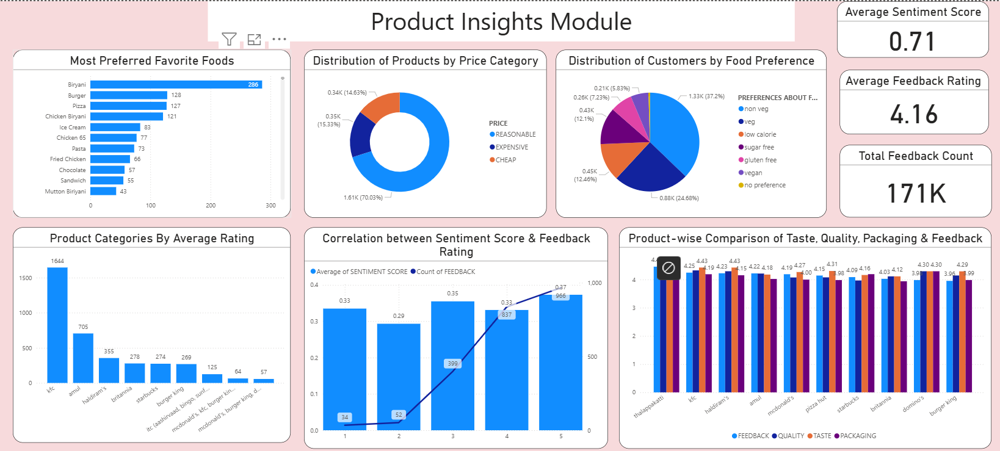
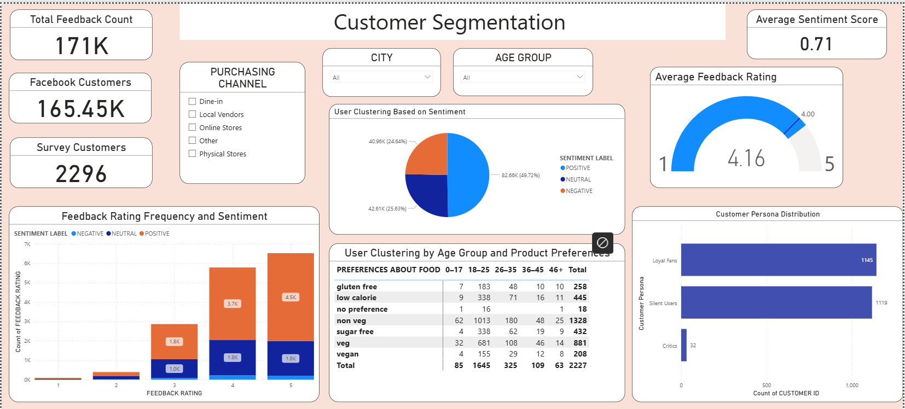
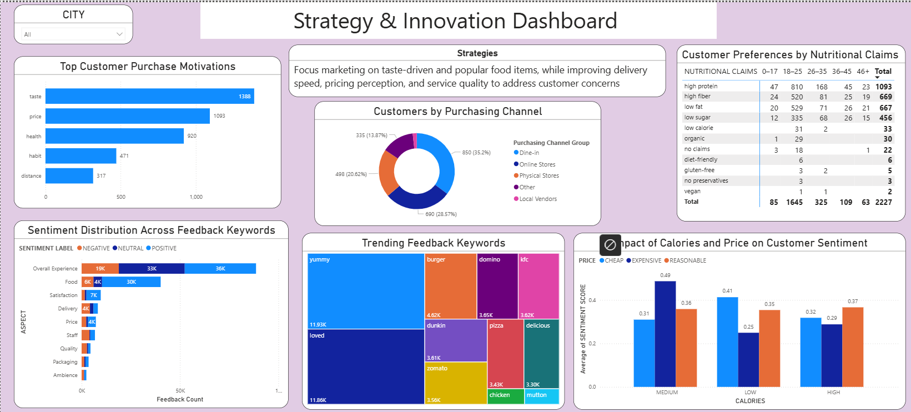

<p align="center">
  
</p>

<h1 align="center">🍽️ FoodTrends – Understanding Customer Preferences in F&B</h1>

<p align="center">
<b>Infosys Springboard Virtual Internship 6.0</b><br>
Data Analytics | NLP | Power BI | Customer Sentiment Analysis
</p>

---

# 📌 Project Overview

FoodTrends is a Data Analytics and Visualization project developed as part of the **Infosys Springboard Virtual Internship 6.0**.

The project analyzes customer feedback collected from multiple sources, including Google Forms surveys, online reviews, and social media platforms, to understand customer preferences and satisfaction. Using **Natural Language Processing (NLP)** and **Power BI**, the project transforms raw customer feedback into meaningful business insights that support product improvement and marketing strategies.

---

# 🎯 Project Objectives

- Collect customer feedback from structured and unstructured sources.
- Perform sentiment analysis using NLP.
- Identify customer preferences and recurring issues.
- Analyze product performance based on customer feedback.
- Segment customers based on sentiment and behavior.
- Generate actionable business insights using interactive dashboards.

---

# 🏗️ System Architecture

```
Google Forms + Social Media Reviews
                │
                ▼
        Data Collection
                │
                ▼
      Data Cleaning & Preprocessing
                │
                ▼
      NLP using TextBlob
      (Sentiment Score & Label)
                │
                ▼
          Power BI Data Model
                │
                ▼
      Interactive Dashboards
```

---

# 🛠️ Technologies Used

| Technology | Purpose |
|------------|---------|
| Power BI | Dashboard Development |
| Power Query | Data Cleaning & Transformation |
| Python | Data Processing |
| TextBlob | Sentiment Analysis |
| Apify | Facebook Comments & Review Scraping |
| Google Forms | Survey Data Collection |
| DAX | KPI Calculations |

---

# 📂 Data Sources

### Structured Data
- Google Forms Survey
- Customer ratings
- Product feedback

### Unstructured Data
- Facebook Comments
- Online Reviews
- Social Media Feedback

Collected using **Apify**.

---

# 🔍 NLP Processing

The project uses the **TextBlob** library to perform sentiment analysis.

Each customer review is assigned:

- Sentiment Score
- Sentiment Label
  - Positive
  - Neutral
  - Negative

---

# 📊 Dashboards Developed

## 1️⃣ Sentiment Analysis Dashboard

This dashboard provides an overview of customer sentiment and feedback patterns across products and regions.

### Key Insights

* Displays the overall distribution of **Positive, Neutral, and Negative** customer feedback.
* Identifies the **top products** receiving the highest customer sentiment.
* Highlights **region-wise sentiment** to understand geographical customer satisfaction.
* Analyzes **aspect-wise sentiment** across food quality, price, delivery, packaging, ambience, and staff.
* Identifies the **most frequently used keywords** from customer reviews to reveal common discussion topics.

---

## 2️⃣ Product Insights Dashboard

This dashboard evaluates product performance and customer preferences using ratings and sentiment analysis.

### Key Insights

* Shows the **most preferred favorite food items** based on customer responses.
* Compares **product categories by average customer ratings**.
* Analyzes the **distribution of products across different price categories**.
* Examines the **relationship between sentiment score and feedback ratings**.
* Compares products based on **taste, food quality, packaging quality, and overall customer feedback**.

---

## 3️⃣ Customer Segmentation Dashboard

This dashboard groups customers based on demographics, purchasing behavior, and sentiment.

### Key Insights

* Segments customers into **Loyal Fans, Silent Users, and Critics**.
* Visualizes **sentiment-based customer clustering**.
* Analyzes **food preferences across different age groups**.
* Compares **feedback ratings with sentiment distribution**.
* Enables customer analysis using **city, age group, and purchasing channel filters**.

---

## 4️⃣ Strategy & Innovation Dashboard

This dashboard provides business recommendations by combining customer preferences, purchasing behavior, and feedback trends.

### Key Insights

* Identifies the **top factors influencing customer purchase decisions**.
* Highlights **trending keywords** extracted from customer feedback.
* Analyzes **customer preferences based on nutritional claims**.
* Examines the **impact of calories and price on customer sentiment**.
* Provides **AI-driven strategy recommendations** to support product improvement and marketing decisions.

---


# 🗂️ Semantic Model

The Power BI semantic model integrates structured and unstructured customer feedback into a centralized **Feedback_Table**, which is connected to **Customer**, **Product**, and **Date** dimension tables. This model enables efficient filtering, relationship management, sentiment analysis, and interactive dashboard reporting.

---

# 📸 Project Screenshots

## Structured Data



---

## Unstructured Data



---

## NLP Script



---

## Dataset with Sentiment Score



---

## Semantic Model



---

## Dashboard 1 – Sentiment Analysis



---

## Dashboard 2 – Product Insights



---

## Dashboard 3 – Customer Segmentation



---

## Dashboard 4 – Strategy & Innovation



---

# 📈 Key Insights

- Customer sentiment trends across products.
- Product strengths and weaknesses.
- Regional customer preferences.
- Customer segmentation based on behavior.
- Business recommendations for product innovation.

---

# 🙏 Acknowledgements

This project was developed as part of the **Infosys Springboard Virtual Internship 6.0**. I sincerely thank my mentors and Infosys Springboard for providing valuable guidance, learning resources, and hands-on experience throughout the internship.
